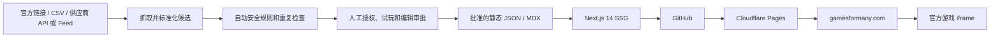

# 技术架构与数据模型

> 状态：阶段 3 可扩展内容架构
> 更新日期：2026-08-11

## 1. 架构结论

第一版采用 Next.js 14 App Router、TypeScript、Tailwind CSS、静态导出和本地 JSON/MDX。代码保存在 GitHub 私有仓库，由 Cloudflare Pages 免费计划自动构建并托管 `gamesformany.com`。Vercel 不作为首发生产环境。

游戏接入采用 `manual-first、API-later`：首批游戏可由人工官方链接/iframe 生成候选；未来 API/feed 只负责生成同样的候选结构，页面、审批规则和生产 JSON 不重写。架构目标可承载数百款记录，但发布数量由授权、安全、试玩和内容质量决定。



## 1.1 信息架构原则

游戏实体、浏览集合和编辑内容分开管理：

| 层级 | 路由 | 作用 | 扩展规则 |
|---|---|---|---|
| Home | `/` | 品牌、two-player 总主题、Local/Online 分流 | 不成为全部游戏的无限列表 |
| Game | `/games/[slug]/` | 唯一可玩实体、玩法、controls、设备和来源 | 每款批准游戏只有一个 canonical URL |
| Player-mode collection | `/category/[slug]/` | local 2-player、online with friends、online multiplayer 等稳定浏览任务 | ≥8 款且有独有选择内容才索引 |
| Genre collection | `/category/[slug]/` | board、sports、racing、arcade 等稳定类型 | 库存和搜索任务足够时启用 |
| Attribute/filter | `/tag/[slug]/` 或站内筛选状态 | same keyboard、mobile、room code 等属性 | 默认作为筛选；≥5 款且有独立需求才成为索引页 |
| Guide | `/blog/[slug]/` | best、compare、年份、long distance、large groups 等决策任务 | 必须有实测、选择方法和独立意图 |

分类不是互斥目录。一个游戏可以同时出现在 `online-with-friends`、`sports` 和 `mobile` 视图中，但 canonical 始终指向同一个游戏页。不得为同一游戏按分类复制多个详情 URL。

## 1.2 规模增长策略

- 30–50 款：静态 JSON、客户端搜索、小数量编辑分类，全部页面预生成；
- 50–200 款：仍可静态导出；增加构建时搜索索引、可解释排序和分类分页/分批加载；
- 200 款以上：先观察构建时间、静态文件数量和搜索体验，再决定是否迁移 Supabase/Workers；不得仅因记录数增加提前引入数据库；
- 无论规模多大，sitemap 只包含批准、canonical、可索引且可稳定启动的页面；
- 分类列表中的筛选参数、排序参数和站内搜索结果默认不索引，避免组合页面爆炸。

## 2. 目录结构

```text
app/
  games/[slug]/page.tsx
  category/[slug]/page.tsx
  tag/[slug]/page.tsx
  blog/[slug]/page.tsx
  about/page.tsx
  contact/page.tsx
  privacy/page.tsx
  terms/page.tsx
  cookies/page.tsx
  sitemap.ts
  robots.ts
components/
  GameCard.tsx
  CategoryGrid.tsx
  AdSlot.tsx
  Breadcrumb.tsx
  SEOHead.tsx
data/
  candidates/
  incoming/
  templates/
  generated/
  games.json
content/blog/
lib/
  games.ts
  seo.ts
  schema.ts
scripts/
  import-games.ts
  build-search-index.ts
public/
  ads.txt
  images/
```

## 3. Game 数据模型

| 字段 | 类型 | 说明 |
|---|---|---|
| slug | string | 唯一、稳定、小写连字符 |
| title | string | 供应商正式标题，需 IP 审核 |
| playerMode | enum | `local-2-player`、`online-2-player`、`online-with-friends`、`online-multiplayer`、`local-multiplayer`、`group-party` |
| primaryGenre | enum | `board`、`sports`、`racing`、`arcade`、`platform`、`puzzle`、`trivia-party`、`card` 等受控类型 |
| collections | string[] | 可进入的编辑集合；必须来自受控词表 |
| attributes | string[] | same-keyboard、separate-devices、mobile、room-code 等经测试属性 |
| iframeUrl | URL | 官方嵌入地址 |
| thumbnail | URL/string | 授权缩略图 |
| editorialSummary | string | 本站原创编辑摘要，不复制供应商 description |
| howToPlay | string | 实测开始方式、循环和胜负目标 |
| controls | object/string | 按玩家与设备记录的实测操作方式 |
| tips | string[] | 2–4 条实测建议 |
| editorialReview | string | 选择理由、适合谁、优点和限制 |
| developer | string | 权利人/开发者 |
| sourcePlatform | enum | GameMonetize/GamePix 等 |
| minPlayers/maxPlayers | number | 明确人数范围，替代难以筛选的自由文本 |
| gameplayType | enum | local/online/both |
| deviceSupport | object | desktop/mobile/tablet 的 tested/pass/fail/unknown |
| inviteMethod | enum/null | room-code/invite-link/private-lobby/random-match/none/unknown |
| accountRequired | boolean/unknown | 是否需要账号 |
| chatOrUgc | boolean/unknown | 是否含聊天或用户内容 |
| adIntegrationStatus | enum | unknown/sdk-detected/ad-observed/not-found；首发必须至少 `sdk-detected`，优先要求 `ad-observed` |
| adObservedDuringReview | boolean | 审核时是否实际看到游戏内广告；受地区、频控和填充率影响 |
| licenseStatus | enum | pending/verified/rejected |
| safetyStatus | enum | pending/approved/rejected |
| approvalStatus | enum | imported/needs-review/approved/rejected/retired |
| licenseEvidenceRef | string | 指向私有授权证据的非敏感引用，不保存 secret |
| sourceUpdatedAt | ISO date | 供应商数据更新时间 |
| featured | boolean | 编辑推荐 |
| publishedAt | ISO date | 首次发布日 |
| reviewedAt | ISO date | 最近人工审核日 |

当前代码模型可在首批数据迁移时逐步升级到上述目标模型；不要为了文档字段一次性重写无关页面。构建必须拒绝 `approvalStatus != approved`、`licenseStatus != verified`、`safetyStatus != approved` 或缺少官方 iframe 的游戏进入生产页面。

## 3.1 导入与人工审批流水线

所有来源进入同一条流水线，API/feed 不能绕过人工审批：

1. **Fetch：** 读取官方 API/feed、CSV 或一行一个的官方游戏链接；token 仅存 `.env.local`/部署 secret；
2. **Normalize：** 映射供应商 ID、标题、开发者、iframe、缩略图和原始分类到统一候选字段；
3. **Deduplicate：** 按 source + official ID、规范化标题、iframe URL 检查重复；
4. **Automatic screening：** 标记成人、赌博、重度暴力、儿童导向、未授权 IP、下载/跳转、聊天/UGC 和字段缺失风险；自动规则只能 reject 或送审，不能自动 approve；
5. **Manual review：** 核对授权证据并在桌面/移动端试玩，确认人数、连接方式、controls、邀请方式、广告体验和安全；
6. **Editorial enrichment：** 编写原创 summary、how-to-play、tips、适合场景、优点和限制；
7. **Approve：** 仅 approved 候选写入生产 `games.json`；rejected/needs-review 保留在候选区，不生成公开页；
8. **Build validation：** 校验 slug 唯一、URL allowlist、必填内容、集合引用、canonical、图片和审核日期；
9. **Static publish：** 生成游戏页、满足门槛的集合页、搜索索引和 sitemap；
10. **Re-review/retire：** iframe 失效、许可变化或内容安全异常时转为 retired，并从 sitemap/集合中移除。

GameMonetize 当前公开 JSON feed 已实测无需凭据，返回数组字段为 `id/title/description/instructions/url/category/tags/thumb/width/height`。具体公开参数和操作记录见 `docs/00b-owner-action-list.md`。导入器仍通过环境变量接收 URL，避免把供应商 URL 规则散落在代码中；如果未来其他 feed 含 token，该值必须只放 `.env.local`/部署 secret。

GamePix Publisher JSON Feed 也已实测接通。其 `sid` 是必须保留的统计归因参数，不是登录密码；完整 Feed URL仍存 `.env.local`，避免在代码多处复制。GamePix 响应为 JSON Feed 对象，游戏位于 `items`，并通过 `next_url` 分页。导入器只读取当前明确请求的页面，不自动遍历 `last_page_url` 指向的整个目录。

## 3.1.1 强制内容与安全政策

供应商分类、quality score 或平台审核不能代替本站审核。候选按以下政策处理：

| 级别 | 内容 | 自动处理 | 是否允许发布 |
|---|---|---|---|
| Hard reject | 成人、色情、NSFW、赌博、赌场、真钱博彩 | `approvalStatus=rejected`、`safetyStatus=rejected` | 禁止 |
| Hard reject | 明确儿童导向：kids/baby/daycare/dress-up/幼儿教育等主题或视觉定位 | `rejected` | 禁止 |
| Hard reject | 未经授权的 Pokémon、Mario、Roblox、Minecraft、Fortnite、影视/卡通角色等 IP | `rejected` | 禁止，除非取得可验证的明确商业授权并重新审核 |
| Hard reject | 明确血腥、gore、重度暴力 | `rejected` | 禁止 |
| Manual review | shooter、weapon、war、zombie、战斗等非血腥暴力词 | 风险标记 | 仅在确认非重度暴力且符合广告安全后考虑 |
| Manual review | chat、voice chat、UGC、文件上传、账号系统 | 风险标记 | 首发原则上排除；例外需单独隐私与安全审核 |
| Manual review | Multiplayer/2 Player 供应商标签 | 保持 `needs-review` | 必须试玩确认真实玩家模式、人数和连接方式 |
| Manual review | mobile、same keyboard、room code、invite link | 保持 unknown | 只有实测后才能写入页面和 SEO 文案 |

游戏内广告是本项目第一收入线的发布硬门槛：必须使用供应商广告分成嵌入地址，并至少检测到 GameMonetize/GamePix 对应广告 SDK 或广告 iframe。审核时应尽量实际观察 pre-roll/interstitial；若因地区、频控或填充率没有展示，记录为 `sdk-detected` 并安排另一设备/网络复测。完全找不到供应商广告 SDK、广告 iframe或后台归因证据的游戏不得批准。

自动筛选宁可产生待复核项，也不能把未命中关键词理解成安全。图片、iframe 内广告、实际玩法和开发者/IP 仍需人工检查。

建议文件边界：

```text
data/incoming/                 # 用户提供的官方链接或原始导出，不直接发布
data/candidates/               # 标准化候选与人工审核状态
data/generated/                # 可复现的构建产物，例如搜索索引
data/games.json                # 仅批准的生产数据
.env.local                     # feed token、publisher ID 等敏感值；不提交 Git
compliance/private/            # 私下保存许可、审批邮件和合同证据
```

## 3.2 分类、搜索和页面生成

- 受控 taxonomy 存在代码/数据配置中，供应商自由标签必须映射后才能使用；
- `playerMode` 和 `primaryGenre` 决定主要浏览入口，`attributes` 用于筛选和页内说明；
- 搜索索引只包含 approved 游戏的标题、受控同义词、genre、player mode 和已验证属性；
- 站内搜索结果页和筛选参数默认 `noindex`，热门稳定需求达到门槛后才提升为编辑集合 URL；
- 分类页面生成前同时检查库存门槛和独有正文，不能仅因 taxonomy 中存在枚举就发布空页；
- 当一个集合超过首屏承载量时，优先提供筛选和可访问的分批列表；若使用分页，canonical/内链/sitemap 规则需单独验收；
- 排序应可解释：编辑推荐、近期审核、匹配玩家模式、设备兼容性；不伪造热门度和玩家数。

## 4. 静态部署约束

- `next.config` 使用静态导出；所有动态路由实现 `generateStaticParams`。
- 不使用 SSR、Server Actions、运行时数据库或服务端 API Route。
- iframe 在用户主动点击 Play 后加载，并预留固定比例空间。
- 供应商 token/secret 不进入浏览器；未来 API 在构建前导入。
- 图片避免依赖 Vercel Image Optimization；使用授权的预处理图片或普通静态/远程资源。
- `public/ads.txt` 公开，真实广告代码在获批前不加载。

## 5. SEO 与分析

- 每页唯一 title、description、canonical、OG、Twitter Card。
- 游戏页输出与可见内容一致的 `VideoGame` 与 Breadcrumb JSON-LD。
- sitemap 只包含 200、canonical、可索引页面。
- 预留 GA4、GSC、Clarity 和 CMP 配置位；默认不开启需要同意的追踪。
- 一个搜索任务只有一个 primary URL；分类、Guide 和游戏页的关键词边界以 `docs/02-keyword-map.md` 为准。
- Title、H1、可见正文和内链基于真实页面任务生成；不得把同义词数组机械拼接成文案。
- 游戏页结构化内容来自已验证的数据字段；未知设备、玩家数、邀请方式不能猜测或输出。

## 6. 迁移路径

当需要 ISR、服务端搜索或 Supabase 时，优先迁移至 Cloudflare Workers + OpenNext；必要时再评估 Vercel Pro。数据层保持统一，迁移不改变 URL。

## 7. 验收清单

- [x] GitHub + Cloudflare Pages 为首发部署方案；
- [x] 手工 JSON 与未来 API 共用数据模型；
- [ ] 静态构建能生成所有指定路由；
- [ ] 未授权游戏无法进入生产构建；
- [ ] ads.txt、sitemap、robots 可公开访问；
- [ ] LCP、INP、CLS 达到既定门槛。
- [x] 已定义可扩展的玩家模式、类型、属性与页面层级；
- [x] 已定义手工/API/feed 共用的候选与人工审批流水线；
- [ ] 代码数据模型升级并兼容当前 6 款游戏；
- [ ] 导入脚本能生成候选，但不能绕过审批写入生产；
- [ ] 数十至数百款数据下搜索、分类构建和 sitemap 验证通过。
